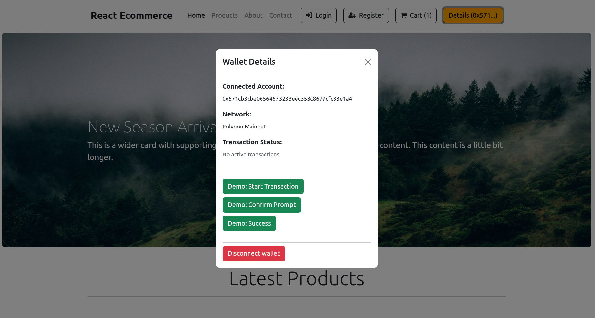

# Techical Assessment - Ecommerce Project with React 18

This is a technical assessment - a demo project of an ecommerce store with a wallet integration.

## UI:
- React 18
- Redux
- Data from [Fake Store API](https://fakestoreapi.com/)

## MetaMask wallet and tx handling with Ethers.js:
  - Connect wallet with ethers.js
  - Show account
  - Show network
  - Account / network change depending on account / network shown in MetaMask
  - Event listeners: `chainChanged` and `accountsChanged` events automatically detect wallet network / account switches
  - Real-time updates: Network state syncs immediately when user changes chains in wallet
  - Friendly names: Chain name mapping for better UX (e.g. `Polygon Mainnet` instead of `Matic`, `Ethereum Mainnet` instead of `homestead`)
  - UI demos for startung a transaction ( + pending), prompt confirmation (confirm transaction in the wallet) and a successful transaction
 - Disconnect wallet (clear the `account` state)

## Screenshots:
Product Card: 


Navbar With Wallet Handling:


Wallet Connection:



## Run Locally

Clone the project

```bash
  git clone git@github.com:vmosharova/dreadsoft-ecommerce.git
```

Go to the project directory

```bash
  cd ecommerce
```

Install dependencies **(use --legacy-peer-deps flag)**

```bash
  npm install --legacy-peer-deps
```

Start the server

```bash
  npm start
```

The server should now be running. You can access the application by opening a web browser and entering the following URL:

```bash
  http://localhost:3000
```
